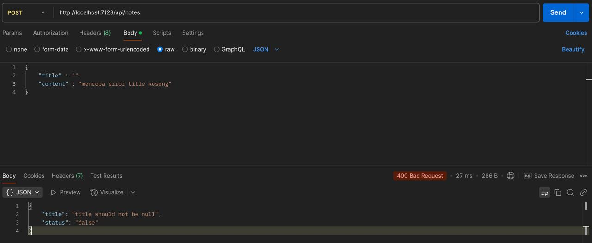
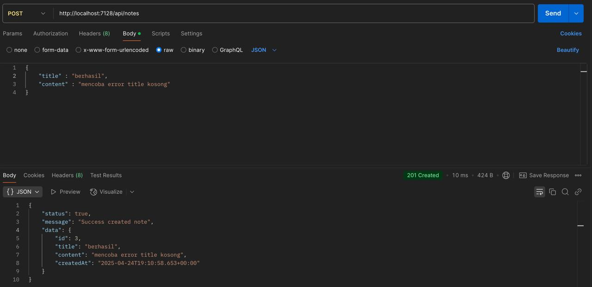
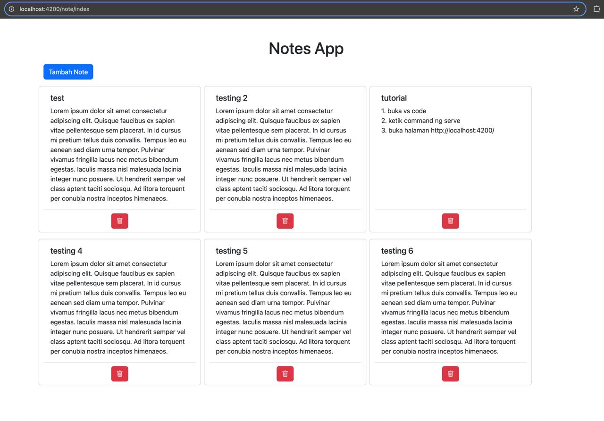
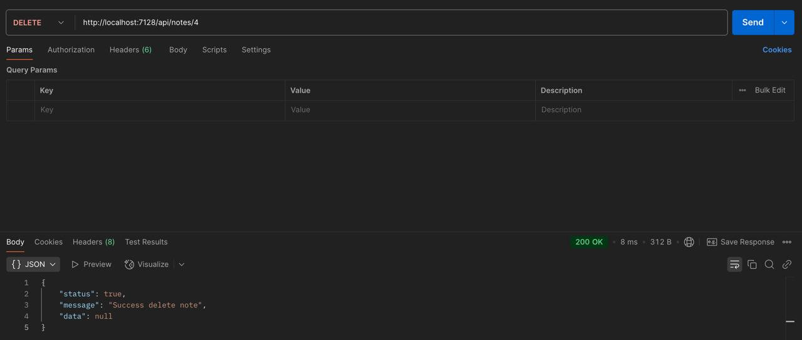

Cara menjalankan aplikasi Angular:
1. clone repo dengan cara: `git clone git@github.com:Arif58/astrapay-angular-test.git`
2. Buka terminal/command prompt
3. Masuk ke direktori project
4. Jalankan perintah: `npm install`
5. Jalankan perintah: `ng serve`

