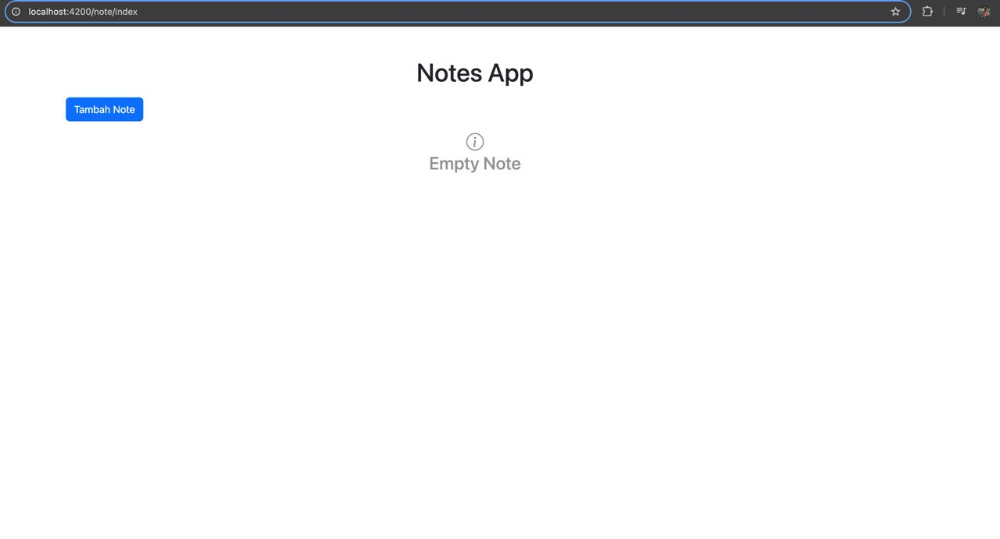

Cara menjalankan aplikasi Angular:
1. clone repo dengan cara: `git clone git@github.com:Arif58/astrapay-angular-test.git`
2. Buka terminal/command prompt
3. Masuk ke direktori project
4. Jalankan perintah: `npm install`
5. Jalankan perintah: `ng serve`

## Dokumentasi Tampilan Aplikasi

### 1. Validasi Gagal

### 2. Validasi Berhasil

### 3. API - Get Notes

### 4. API - Add Note

### 5. API - Delete Note

### 6. Tampilan Kosong

### 7. Tampilan Berisi 6 Notes

